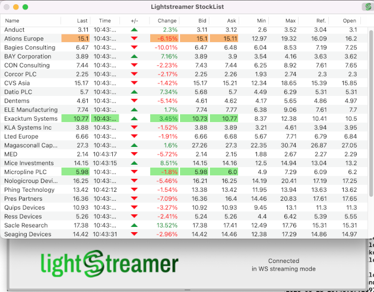

## Lightstreamer - Basic Stock-List Demo - OS X Client

<!-- START DESCRIPTION lightstreamer-example-stocklist-client-osx -->

This project contains an example of an application for Mac that employs the [Lightstreamer OS X Client library](http://www.lightstreamer.com/docs/client_os_x_api/index.html).

## Live Demo

 
###[ View live demo](http://demos.lightstreamer.com/StockListDemo_OSX/StockList Demo for OS X.app.zip) 
(download "StockList Demo for OS X.app.zip"; unzip it; launch "StockList Demo for OS X")

### Details

The example demonstrates a simple stock list application fed through a Lightstreamer connection. 
The example is comprised of the following files and folders:
- <b>"StockList Demo for OS X"</b>: sources to build the application, written in Objective-C.
- <b>"Lightstreamer client for OS X"</b> (/lib and /include): should contain Lightstreamer library, to be used for the build process.
- <b>"StockList Demo for OS X.xcodeproj"</b>: a full Xcode project specification, ready for a compilation of the demo sources.

<!-- END DESCRIPTION lightstreamer-example-stocklist-client-osx -->

## Install

If you want to install a version of this demo pointing to your local Lightstreamer Server, follow these steps:

* Note that, as prerequisite, the [Lightstreamer - Stock- List Demo - Java Adapter](https://github.com/Weswit/Lightstreamer-example-Stocklist-adapter-java) has to be deployed on your local Lightstreamer Server instance. Please check out that project and follow the installation instructions provided with it.
* Launch Lightstreamer Server.
* Download the `deploy.zip` file, which you can find in the [deploy release](https://github.com/Weswit/Lightstreamer-example-StockList-client-osx/releases) of this project and extract the `StockList Demo for OS X.app` folder.
* Launch "StockList Demo for OS X". Under OS X 10.8 or newer, the Gatekeeper may signal the app is not signed. You can safely run the app or rebuild it with the included Xcode project.

## Build

To build your own version of the demo, instead of using the one provided in the `deploy.zip` file from the Install section above, you should complete this project with the Lighstreamer iOS Client library. Please:
* drop into the `Lightstreamer client for OS X/lib` folder of this project the `libLightstreamer_OSX_client.a` file from the `/DOCS-SDKs/sdk_client_os_x/lib` of [latest Lightstreamer distribution](http://www.lightstreamer.com/download).
* drop into the `Lightstreamer client for OS X/include` folder of this project all the include files from the `/DOCS-SDKs/sdk_client_os_x/include` of [latest Lightstreamer distribution](http://www.lightstreamer.com/download).

### Deploy

With the current settings, the demo tries to connect to the demo server currently running on Lightstreamer website. 
The demo can be reconfigured and recompiled to connect to the local installation of Lightstreamer Server. You just have to change SERVER_URL, as defined in `StockList Demo for OS X/StockListWindowController.m`; a ":port" part can also be added.
The example requires that the [QUOTE_ADAPTER](https://github.com/Weswit/Lightstreamer-example-Stocklist-adapter-java) and [LiteralBasedProvider](https://github.com/Weswit/Lightstreamer-example-ReusableMetadata-adapter-java) have to be deployed in your local Lightstreamer server instance. The factory configuration of Lightstreamer server already provides this adapter deployed. 

## See Also

### Lightstreamer Adapters Needed by This Demo Client

<!-- START RELATED_ENTRIES -->
* [Lightstreamer - Stock-List Demo - Java Adapter](https://github.com/Weswit/Lightstreamer-example-Stocklist-adapter-java)
* [Lightstreamer - Reusable Metadata Adapters- Java Adapter](https://github.com/Weswit/Lightstreamer-example-ReusableMetadata-adapter-java)

<!-- END RELATED_ENTRIES -->

### Related Projects

* [Lightstreamer - Stock-List Demos - HTML Clients](https://github.com/Weswit/Lightstreamer-example-Stocklist-client-javascript)
* [Lightstreamer - Basic Stock-List Demo - iOS Client](https://github.com/Weswit/Lightstreamer-example-StockList-client-ios)
* [Lightstreamer - Basic Stock-List Demo - jQuery (jqGrid) Client](https://github.com/Weswit/Lightstreamer-example-StockList-client-jquery)
* [Lightstreamer - Stock-List Demo - Dojo Toolkit Client](https://github.com/Weswit/Lightstreamer-example-StockList-client-dojo)
* [Lightstreamer - Basic Stock-List Demo - Java SE (Swing) Client](https://github.com/Weswit/Lightstreamer-example-StockList-client-java)
* [Lightstreamer - Basic Stock-List Demo - .NET Client](https://github.com/Weswit/Lightstreamer-example-StockList-client-dotnet)
* [Lightstreamer - Stock-List Demos - Flex Clients](https://github.com/Weswit/Lightstreamer-example-StockList-client-flex)
* [Lightstreamer - Basic Stock-List Demo - Silverlight Client](https://github.com/Weswit/Lightstreamer-example-StockList-client-silverlight)
* [Lightstreamer - Basic Stock-List Demo - Android Client](https://github.com/Weswit/Lightstreamer-example-StockList-client-android)
* [Lightstreamer - Basic Stock-List Demo - Windows Phone Client](https://github.com/Weswit/Lightstreamer-example-StockList-client-winphone)
* [Lightstreamer - Basic Stock-List and Round-Trip Demo - BlackBerry Client](https://github.com/Weswit/Lightstreamer-example-StockList-client-blackberry)

## Lightstreamer Compatibility Notes

- Compatible with Lightstreamer OS X Client Library version 1.0.0 or newer.
- For Lightstreamer Allegro (+ OS X Client API support), Presto, Vivace.
